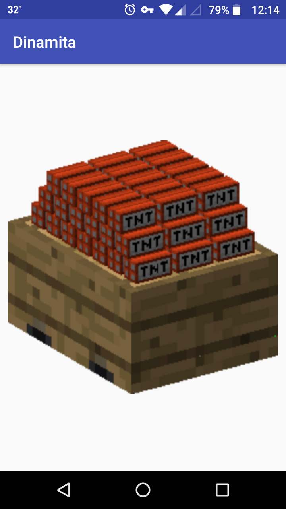

# Dinamita
Aplicación de ejemplo para el curso de introducción al desarrollo en Android dictado en [Gran Reactor](https://granreactor.comg), en Febrero de 2018.

Coordinador: Martín Vukovic

 

Sencillo juego que "detona" un explosivo si no se mueve el teléfono con mucha delicadeza. 

Esta aplicación se utilizó para ejemplificar el uso de:

- RelativeLayout
- ImageView
- onResume()
- onStop()
- SensorManager
- Vibrator
- MediaPlayer
- Permisos: Vibrate
- Features: Accelerometer
